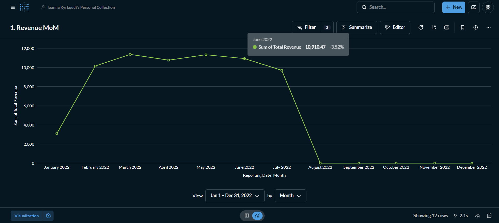
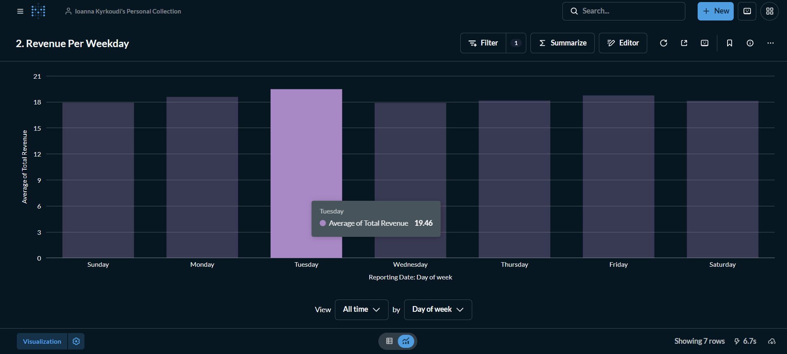
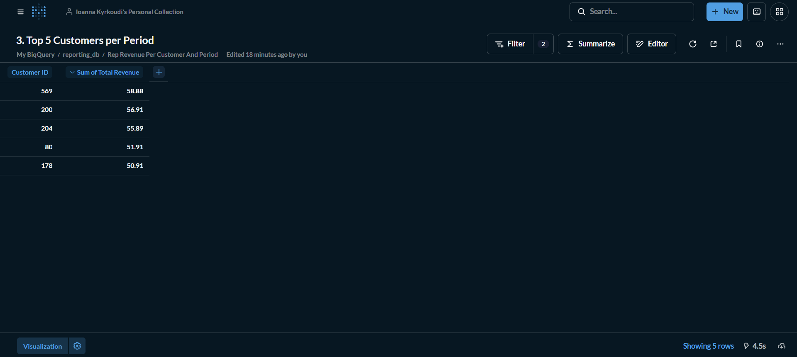
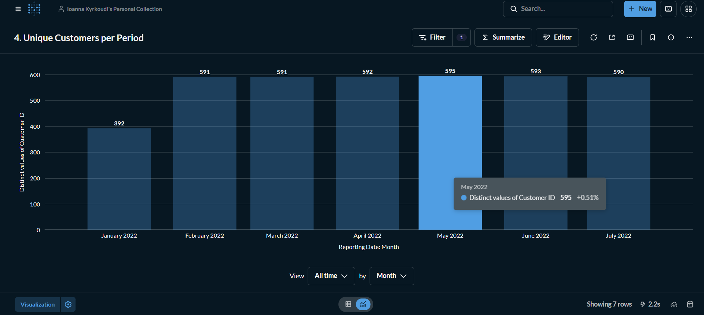

# Reporting
The final step of my Capstone Project was to visualize the prepared data. Visuals were created with both Tableau Public and Metabase.

## 📈 Tableau Visualizations

Check out my dashboard at https://public.tableau.com/app/profile/ioanna.kyrkoudi6985/vizzes

## 📊 Metabase Visualizations

